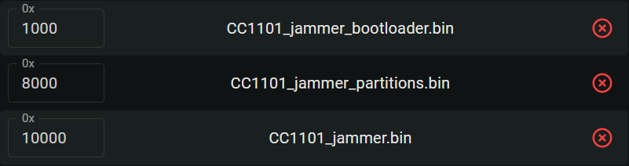
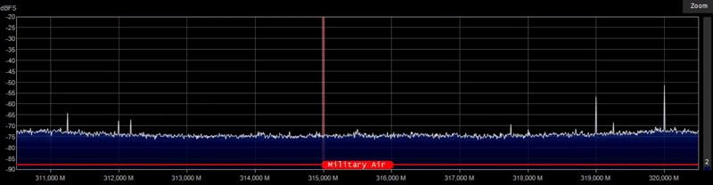

  
  <h1> 🌟 CC1101 Jammer 🌟 </h1>

Welcome to the **CC1101 Jammer** repository! 🎉 Dive into the world of RF interference with this project based on the ESP32 and CC1101 technology.

## 📚 Table of Contents
- [📢 Please Read](#-please-read)
- [🚀 What Can You Do with This?](#-what-can-you-do-with-this)
- [📋 List of Components](#-list-of-components)
- [🧑‍🔧 Let's Get Started with Soldering!](#-lets-get-started-with-soldering)
- [📦 Flash Firmware](#-flash-firmware)
- [🎉 Final Outcome](#-final-outcome)
- [❤️ Support the project](#-support-the-project)
- [🌐 Follow Me for Updates](#-follow-me-for-updates)

-----

## 📢 Please Read
At the moment, there are very few functions and features in this project, but if I see that someone really needs this project, then the project will continue to develop.

-----

## 🚀 What Can You Do with This?
This jammer is built on the **ESP32** architecture integrated with **CC1101** module. With its extraordinary capabilities, you can effectively disrupt signals at frequencies from 300 to 928 Mhz. This frequency range includes:
- **Garages 🏠**
- **Doorbells 🔊**
- **Cars 🚗**
- **And much more**

-----

## 📋 List of Components
To bring this project to life, you will need the following components:
1. **CC1101**🛠️
2. **ESP32-DevKitC** *(with Type-C)* **or**  **ESP32-DevKit V1** *(with Micro USB)* ⚙️
3. **128x64 OLED display** 📺
4. **3 Tactile buttons** 🔘

-----

## 🧑‍🔧 Let's Get Started with Soldering!

### CC1101 Connection
| **Pin Name** | **ESP32 GPIO** |
|--------------|----------------|
| VCC          | 3.3V           |
| GND          | GND            |
| SCK          | GPIO 18        |
| MISO         | GPIO 19        |
| MOSI         | GPIO 23        |
| CSN          | GPIO 5         |
| GDO0         | GPIO 2         |
| GDO2         | GPIO 4         |

### OLED Connection
| **Pin Name** | **ESP32 GPIO** |
|--------------|----------------|
| VCC          | 3.3V           |
| GND          | GND            |
| SCL          | GPIO 22        |
| SDA          | GPIO 21        |

### Button Connection
| **Button Actions** | **ESP32 GPIO** |
|--------------|----------------|
| OK           | GPIO 12        |
| NEXT         | GPIO 14        |
| PREVIOUS     | GPIO 13        |

-----

## 📦 Flash Firmware
Follow these steps to flash the firmware:
1. Download the firmware from the **[releases](https://github.com/W0rthlessS0ul/CC1101_jammer/releases)** section that corresponds to your display.
2. Navigate to **ESPWebTool**: [ESPWebTool](https://esp.huhn.me/)
3. Arrange the files as per the table below:

| **Address** | **File Name**                             |
|-------------|-------------------------------------------|
| 0x1000      | CC1101_jammer_bootloader.bin              |
| 0x8000      | CC1101_jammer_partitions.bin              |
| 0x10000     | CC1101_jammer.bin                          |

4. Click "Flash," and once the installation is complete, **restart your board** and enjoy using your jammer!

-----

## 🎉 Final Outcome

### Normal Spectrum

### Jam Spectrum

-----

## ❤️ Support the project
If you would like to support this project, please consider starring the repository or following me! If you appreciate the hard work that went into this, buying me a cup of coffee would keep me fueled! ☕ 

**BTC Address:** `bc1qvul4mlxxw5h2hnt8knnxdrxuwgpf4styyk20tm`

**ETH Address:** `0x5c54eAb2acFE1c6C866FB4b050d8B69CfB1138Af`

**LTC Address:** `LbdzCsYbxuD341raar6Cg1yKavaDq7fjuV`

**XRP Address:** `rKLLPzoBGfqY3pAQPwTFPRYaWjpHSwHNDw`

**ADA Address:** `addr1qyz2aku0ucmxqnl60lza23lkx2xha8zmxz9wqxnrtvpjysgy4mdcle3kvp8l5l7964rlvv5d06w9kvy2uqdxxkcryfqs7pajev`

**DOGE Address:** `DBzAvD62yQUkP4Cb7C5LuFYQEierF3D3oG`

Every donation is greatly appreciated and contributes to the ongoing development of this project!

---

## 🌐 Follow Me for Updates
Stay connected to receive the latest updates:

