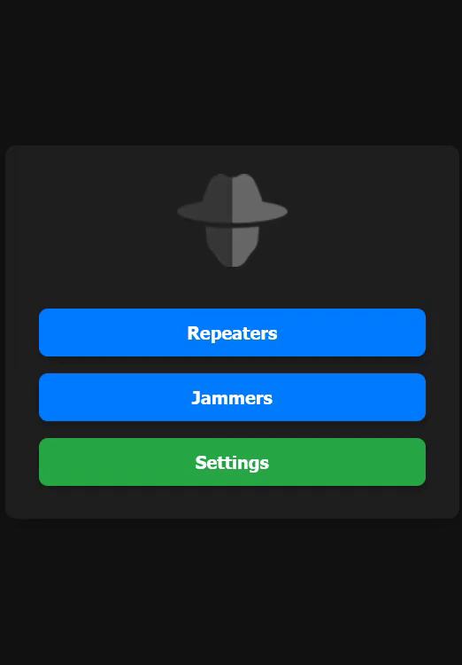
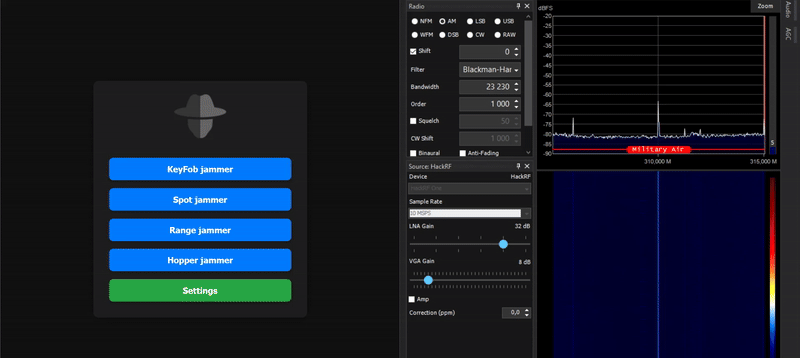
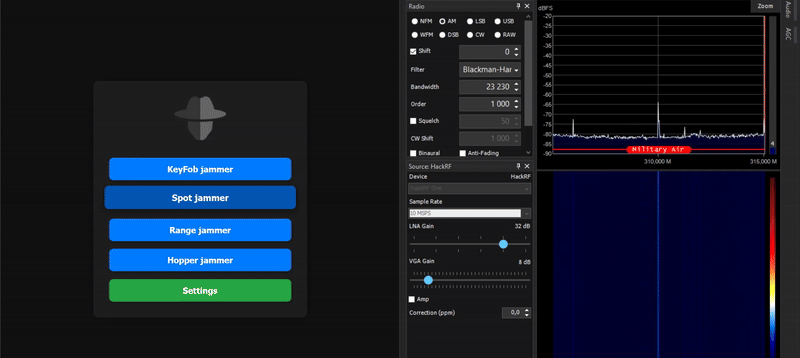
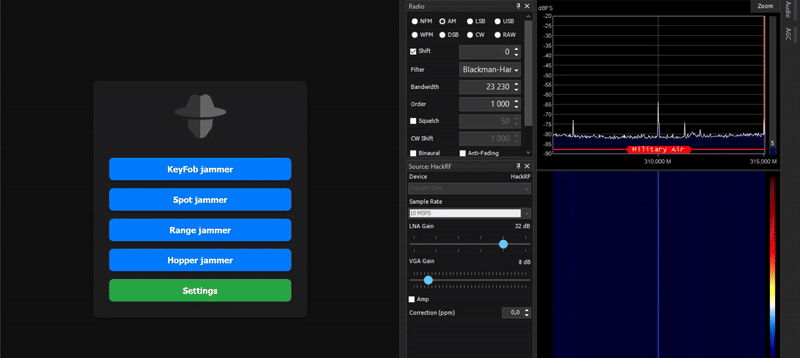
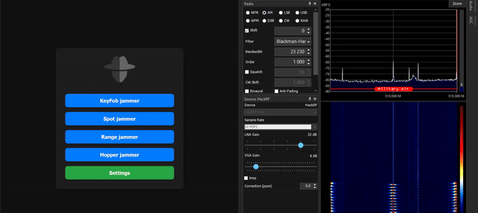

  
  <h1> 🌟 CC1101 Jammer 🌟 </h1>

Welcome to the **CC1101 Jammer** repository! 🎉 Dive into the world of RF interference with this project based on the ESP32 and CC1101 technology.

## 📚 Table of Contents
- [🎯 Possible Additions](#-possible-additions)
- [🚀 What Can You Do with This?](#-what-can-you-do-with-this)
- [📋 List of Components](#-list-of-components)
- [🧑‍🔧 Let's Get Started with Soldering!](#-lets-get-started-with-soldering)
- [📦 Flash Firmware](#-flash-firmware)
- [🌐 Web Interface](#-web-interface)
- [🎉 Final Outcome](#-final-outcome)
- [🙏 Acknowledgments](#-acknowledgments)
- [❤️ Support the project](#-support-the-project)
- [⭐ Star History](#-star-history)

-----

## 🎯 Possible Additions
- **Recording and playback of more than just RAW files**
- **Auto-tuning sampling interval**
- **Spectrum Scanner**
- **RollJam**
- **Change the direction of the project beyond just jammer**

***`If you have the capability to assist with these features, please feel free to create pull requests!`***

-----

## 🚀 What Can You Do with This?
This jammer is built on the **ESP32** architecture integrated with **CC1101** module. With its extraordinary capabilities, you can effectively disrupt signals at frequencies from 300 to 928 Mhz. This frequency range includes:
- **Garages 🏠**
- **Doorbells 🔊**
- **Cars 🚗**
- **And much more**

-----

## 📋 List of Components
To bring this project to life, you will need the following components:
1. **CC1101**🛠️
2. **ESP32-DevKitC** *(with Type-C)* **or**  **ESP32-DevKit V1** *(with Micro USB)* ⚙️
3. **128x64 or 128x32 OLED display** 📺 *(Not required when using the "without OLED" version)*
4. **3 Tactile buttons** 🔘 *(Not required when using the "without OLED" version)*

-----

## 🧑‍🔧 Let's Get Started with Soldering!

<strong>With OLED</strong>

### CC1101 Connection
| **Pin Name** | **ESP32 GPIO** |
|--------------|----------------|
| VCC          | 3.3V           |
| GND          | GND            |
| SCK          | GPIO 18        |
| MISO         | GPIO 19        |
| MOSI         | GPIO 23        |
| CSN          | GPIO 5         |
| GDO0         | GPIO 2         |
| GDO2         | GPIO 4         |

### OLED Connection
| **Pin Name** | **ESP32 GPIO** |
|--------------|----------------|
| VCC          | 3.3V           |
| GND          | GND            |
| SCL          | GPIO 22        |
| SDA          | GPIO 21        |

### Button Connection
| **Button Actions** | **ESP32 GPIO** |
|--------------|----------------|
| OK           | GPIO 12        |
| NEXT         | GPIO 14        |
| PREVIOUS     | GPIO 13        |

<strong>Without OLED</strong>

### CC1101 Connection
| **Pin Name** | **ESP32 GPIO** |
|--------------|----------------|
| VCC          | 3.3V           |
| GND          | GND            |
| SCK          | GPIO 18        |
| MISO         | GPIO 19        |
| MOSI         | GPIO 23        |
| CSN          | GPIO 5         |
| GDO0         | GPIO 2         |
| GDO2         | GPIO 4         |

-----

## 📦 Flash Firmware
Follow these steps to flash the firmware:
1. Download the firmware from the **[releases](https://github.com/W0rthlessS0ul/CC1101_jammer/releases)** section that corresponds to your display.
2. Navigate to **ESPWebTool**: [ESPWebTool](https://esp.huhn.me/)
3. Arrange the files as per the table below:

| **Address** | **File Name**                             |
|-------------|-------------------------------------------|
| 0x1000      | CC1101_jammer_bootloader.bin              |
| 0x8000      | CC1101_jammer_partitions.bin              |
| 0x10000     | CC1101_jammer.bin                          |

4. Click "Flash," and once the installation is complete, **restart your board** and enjoy using your jammer!

-----

## 🌐 Web Interface

- To utilize the web interface, please follow the steps outlined below.
1. activate the **CC1101 jammer**.
2. Connect to the Wi-Fi network named `jammer` using the password `W0rthlessS0ul`.
3. open your web browser and navigate to the IP address `192.168.4.1`.
4. Now you can control your nRF24 jammer through an web interface.

-----

## 🎉 Final Outcome

### Normal Spectrum

### Jam KeyFob

### Jam Spot

### Jam Range

### Jam Hopper

-----

## 🙏 Acknowledgments

- [mcore1976](https://github.com/mcore1976) - **The original creator of the [cc1101-tool](https://github.com/mcore1976/cc1101-tool) repository (from where the principle of signal reception was taken)**

-----

## ❤️ Support the project
If you would like to support this project, please consider starring the repository or following me! If you appreciate the hard work that went into this, buying me a cup of coffee would keep me fueled! ☕ 

**BTC Address:** `bc1qvul4mlxxw5h2hnt8knnxdrxuwgpf4styyk20tm`

**ETH Address:** `0x5c54eAb2acFE1c6C866FB4b050d8B69CfB1138Af`

**LTC Address:** `LbdzCsYbxuD341raar6Cg1yKavaDq7fjuV`

**XRP Address:** `rKLLPzoBGfqY3pAQPwTFPRYaWjpHSwHNDw`

**ADA Address:** `addr1qyz2aku0ucmxqnl60lza23lkx2xha8zmxz9wqxnrtvpjysgy4mdcle3kvp8l5l7964rlvv5d06w9kvy2uqdxxkcryfqs7pajev`

**DOGE Address:** `DBzAvD62yQUkP4Cb7C5LuFYQEierF3D3oG`

Every donation is greatly appreciated and contributes to the ongoing development of this project!

---

## ⭐ Star History

<a href="https://www.star-history.com/#W0rthlessS0ul/CC1101_jammer&type=date&legend=top-left">
 <picture>
   <source media="(prefers-color-scheme: dark)" srcset="https://api.star-history.com/svg?repos=W0rthlessS0ul/CC1101_jammer&type=date&theme=dark&legend=top-left" />
   <source media="(prefers-color-scheme: light)" srcset="https://api.star-history.com/svg?repos=W0rthlessS0ul/CC1101_jammer&type=date&legend=top-left" />
   
 </picture>
</a>
